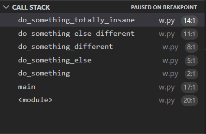

# Stacks

The stack uses "Last in, First out" (LIFO) in order to add and remove things from itself. This means that the last thing that is added to the stack is the first thing that is removed when you go to remove something from it. This is useful to keep track of where you have been or values that you have used and may need to use again in the future. In Python, a list is used to implement a stack.

## Call Stack

Have you ever wondered how a program keeps track of where it is in your code, and how it knows what functions to go back to? That is one way a stack is used in Python. The term for this specific example is the **_Call Stack_**, and it can be seen when running the debugger on a python program. It looks like this:



As you can see, the program enters the function main(), then do_something(), do_something_else(), do_something_different(), etc. When a function finishes, it is removed from the call stack.

## Stack of Plates

Another example of a stack is a stack of plates. Each plate that is added goes on top of the previous plate. When you want to use a plate, you take the one off of the top. The stack functions in the same way, with last item that was added being the first to be removed.


## Push & Pop

Adding to the stack is called **Push** and taking off of the stack is called **Pop**. These are important because it allows you to change the stack 

### Push

Because a stack is implemented using a list, to push to a stack you use the `append()` built in function. For example:

```python
stack = [1, 2, 3, 4]
stack.append(5)
```

Before pushing to the stack it looked like: 

`stack = [1, 2, 3, 4]` 

After pushing the stack now contains 5 as well: 

`stack = [1, 2, 3, 4, 5]`

### Pop

To remove from a stack, you use the `pop()` built in function. When using pop, it returns the value that it took off of the list as well. For example:

```python
stack = [1, 2, 3, 4, 5]
x = stack.pop()
```

Before popping off the stack it looked like:

`stack = [1, 2, 3, 4, 5]`

After popping off the stack, the value at the end of it is removed and can be stored if you set it equal to a variable. It now looks like:

`stack = [1, 2, 3, 4]`

`x = 5`


## Other Operations

Other common operations on stacks include getting the size, and checking if it is empty.

Get size (returns the number of elements in the stack):

```python
len(stack)
```

Check if empty (returns boolean of if stack is empty):

```python
len(stack) == 0
```

## Big O

Push: O(1)

Pop: O(1)

Get size: O(1)

Check if empty: O(1)

All of the operations listed for stacks in this module are very efficient, and are all O(1). This is why stacks are a great data structure to use in appropriate places.

## Example

```python
my_stack = ['this', 'is', 'an', 'amazing', 'example']

x = my_stack.pop() # pop

print(x)

print(len(my_stack))

my_stack.append('day') # push

print(len(my_stack))

print(my_stack)
```

Output:

```
example
4
5
['this', 'is', 'an', 'amazing', 'day']
```

## Problem

Implement a stack to keep track of who is using what plates and what plates are available, using the 
[stack assignment](assignments/stack.py) file.

After at least attempting to solve, check your answer against a 
[possible solution](solutions/stack_solution.py).
