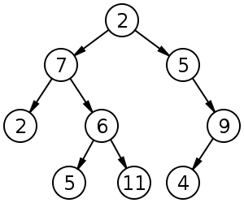
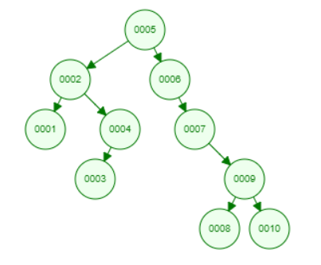
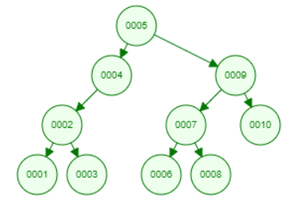

# Trees

As we all know, a tree is a plant that has a root, and then branches out and gets larger the farther up it is. This is very similar to the list data structure, but the tree is kind of turned upside down, with the root being at the top. Trees are similar to linked lists, but the difference is that each node in a tree is able to link to multiple other nodes. Trees are useful, because they can provide a way for things that are used more often to be closer to the top of the tree, and things that are used less often to be at the bottom, allowing for more efficiency. They can also be used to order stuff so that you do not have to look through every node in order to find what you are looking for, and more.

## Structure

A tree always has a starting node, known as the root. It is just a single node.

From that node, it can have any number of links/pointers to other nodes. The nodes that the current node you are looking at point to are known as the child nodes, while the current node is known as the parent node. The amount of pointers a node can have classifies what type of tree it is. In this example, each node can have two or less pointers.

As you can see, the root node **2** has a left and a right pointer. The left one, **7**, points to another **2** and a **6**. The second **2** does not have any pointers, but the **6** points to **5** and **11**. The right one, **5**, points to a **9**, which has only one pointer, pointing to **4**. *Leaf* nodes are the nodes which have no pointers. In this picture, the leaf nodes are the nodes with value 2 (the second 2, not the root node), 5, 11, and 4. 

## Binary Tree

As mentioned earlier, a tree can have any number of pointers per node. The image above is called a **binary tree**, because no node has more than 2 pointers.

A common use for a binary tree is to show how a binary search is done using a tree. When creating a binary search tree, the root node will be at the top as per usual, but all values less than the current node you are looking at will go to the left of the current node, and all values that are greater than the current node you are looking at will go to the right of the current node.

For example, if you had a root node of value 5, and wanted to add a node with value 2, then node 5 would create a left pointer to node 2. If you wanted to add a node with value 6, then node 5 would create a right pointer to node 6. If you then wanted to add a node with value 4, then you would see that it is less than 5, go along the left pointer to node 2, and then compare at that point. Since 4 is greater than 2, node 2 would create a right pointer to node 4. 
 
The image below shows this process:

Adding some more nodes, the tree could end up looking like this:

It is important to know that even if you add the some number nodes, your tree may not look the same. This is because the order that you add the nodes in may make the tree look different. Here is a tree with the same nodes as the previous, but the nodes were added in a different order:

Both trees are formatted to be binary search trees, and both have the same nodes with the same data, but they look different because of the order that the nodes were added in.

## Balanced Trees

